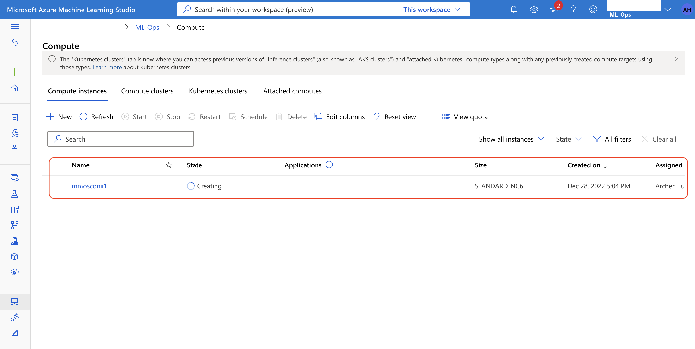
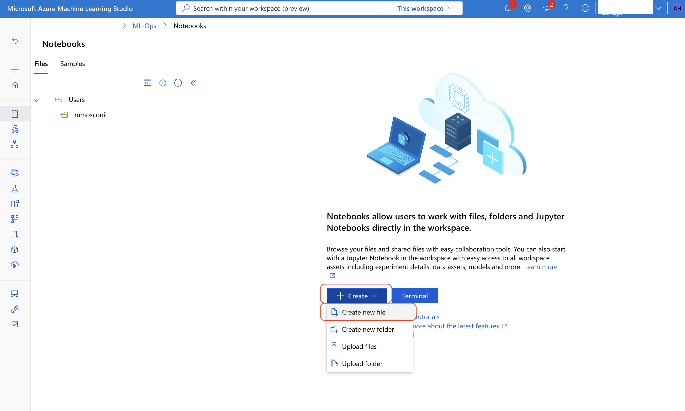

# Azure ML Ops
## 透過 Chrome 開啟 Azure Portal
* https://portal.azure.com/

## 到 Azure Machine Learning
* 於搜尋框輸入 `Azure Machine Learning` > 點選 `Azure Machine Learning` 搜尋結果

## 進入到 Workspace
* 點選 `ML-Ops`

## 進入到 Studio
* 點選 `Launch studio`

## 建立所要使用的算力
* 點選 `Compute`

* 點選 `+ New`

* 輸入相關資訊
  * `Compute name` 欄位輸入可識別的名稱
  * `Virtual machine type` 欄位請選擇 `GPU`
  * `Virtual machine size` 欄位請選擇所要用到的規格
  * 以上資訊輸入完成後點選 `Create`

* 建立過程中

* 建立完成

## 開啟所建立的機器中的 Notebooks
* 點選左上方 `Notebooks` 的 ICON

## 建立 Jupyter 檔案
* 點選 `+ Create` > 點選 `Create new file`

* 輸入相關資訊
  * `File name` 欄位請取一個唯一可識別的名稱且副檔名為 `ipynb`
  * `File type` 欄位請選擇 `Notebook (*.ipynb)`
  * 以上資訊輸入完成後請點選 `Create`

* 建立完成

## 用完請記得將機器關機【 切記 】
* 點選左下方 `Compute` 的 ICON

* 點選所要關閉的機器

* 點選上方 `Stop`

## 將機器開機
* 點選左下方 `Compute` 的 ICON

* 點選所要開啟的機器

* 點選上方 `Start`
